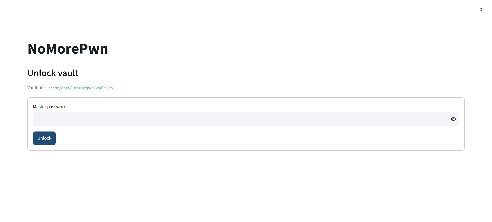
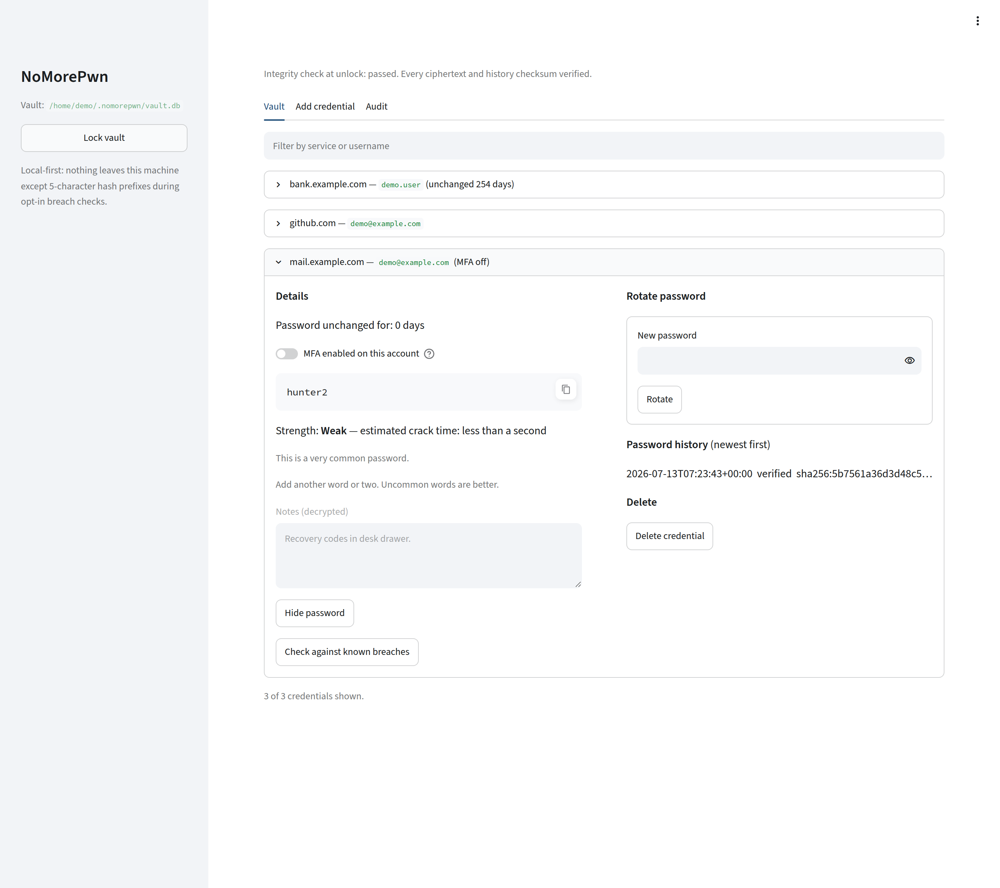
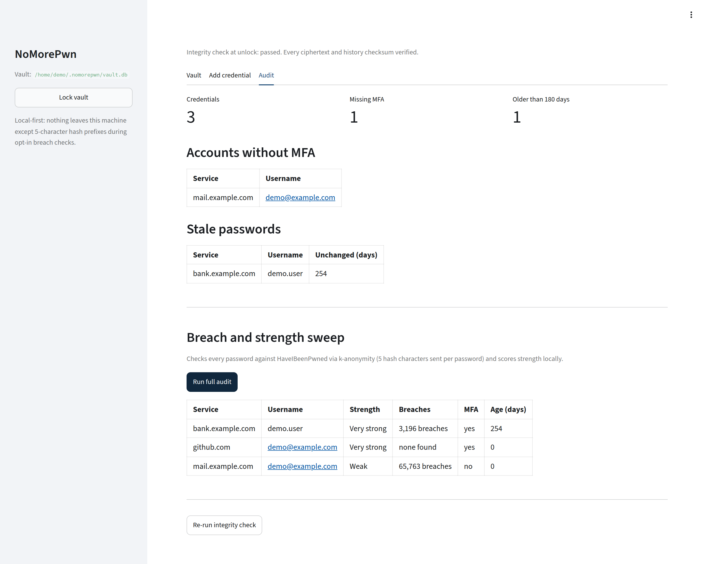

# NoMorePwn — Local Password Manager and Security Auditor

A local-first, zero-knowledge credential vault with built-in security
auditing. One SQLite file on your disk, one Streamlit dashboard in your
browser. Nothing leaves your machine unless you explicitly export an
encrypted backup or run an opt-in breach check.

## Features

- **Local vault** — add, view, rotate, and delete credentials in a web
  UI served on localhost (Streamlit + SQLite).
- **Zero-knowledge encryption** — Argon2id key derivation (PBKDF2-600k
  fallback) and AES-256-GCM per field. The master key is held in memory
  only and never written to disk.
- **Breach checks via k-anonymity** — HaveIBeenPwned lookups send only
  the first 5 characters of a SHA-1 hash. The password itself never
  leaves your machine.
- **MFA tracking** — a per-account flag, surfaced in the vault list and
  the audit report, for accounts where multi-factor authentication is
  not yet enabled.
- **Strength estimation** — zxcvbn pattern-aware scoring, fully offline.
- **Tamper-evident history** — every password version is checksummed
  (SHA-256) and GCM-authenticated, and the whole vault is verified
  automatically at every unlock.
- **Injection-resistant by construction** — parameterized queries only,
  allowlist input validation, and a test that fails if dynamic SQL is
  ever introduced.

Full design details: [docs/ARCHITECTURE.md](docs/ARCHITECTURE.md)

## Demo

Unlocking the vault. The master password is stretched with Argon2id
into the in-memory encryption key; an integrity sweep of every
ciphertext runs on unlock:



The vault view. Entries that need attention are flagged inline (MFA
off, stale passwords). Expanding an entry gives reveal, strength
estimate, rotation with tamper-evident history, and a two-step delete:



The audit view. Summary counts, accounts missing MFA, stale passwords,
and an on-demand sweep that scores every password locally and checks it
against known breaches via k-anonymity:



## Quickstart

```bash
git clone <this-repo> && cd NoMorePwn-Password-Manager
python -m venv .venv && source .venv/bin/activate
pip install -r requirements.txt

# 1. Create your encrypted vault (choose a strong master passphrase)
python scripts/init_db.py

# 2. Import an existing plaintext file (service,username,password per line)
python scripts/import_notepad.py my-old-passwords.txt

# 3. Launch the dashboard
streamlit run app.py
```

Open http://localhost:8501, unlock, and review the **Audit** tab. Once
the import is verified, securely delete the plaintext file
(`shred -u my-old-passwords.txt` on Linux).

## Encrypted cloud backup (optional)

```bash
# Everything is sealed with AES-256-GCM before it leaves your machine:
python scripts/backup_tool.py export --out vault-backup.nmpbak
# The .nmpbak blob is safe to store in any cloud drive.

# Restore on any machine:
python scripts/backup_tool.py restore vault-backup.nmpbak
```

## Project layout

```
├── app.py                    # Streamlit dashboard (unlock, vault, audit)
├── requirements.txt
├── .streamlit/config.toml    # UI theme
├── nomorepwn/                # core library
│   ├── config.py             #   paths and audit thresholds
│   ├── crypto.py             #   Argon2id/PBKDF2 KDF, AES-256-GCM, checksums
│   ├── db.py                 #   SQLite layer — parameterized queries only
│   ├── validation.py         #   allowlist input validation
│   ├── vault.py              #   orchestration: unlock, CRUD, tamper sweep
│   ├── strength.py           #   zxcvbn strength scoring (offline)
│   └── leakcheck.py          #   HIBP k-anonymity range queries
├── scripts/
│   ├── init_db.py            # create a new vault
│   ├── import_notepad.py     # bulk-import plaintext passwords
│   └── backup_tool.py        # zero-knowledge export/restore blob
├── tests/test_core.py        # crypto, tamper, validation and SQL-policy tests
└── docs/ARCHITECTURE.md      # security model
```

## Running the tests

```bash
python -m unittest discover tests -v
```

## Security limitations

- The master password is the only key. There is no recovery mechanism.
- Encrypted fields cannot be read without the passphrase, but service
  names and usernames are stored as visible metadata in v0.1. Treat the
  vault file as private.
- No tool can protect an unlocked vault from malware already running on
  the machine. Lock the vault when you step away.
