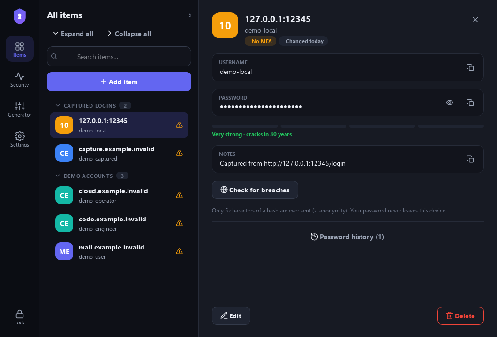
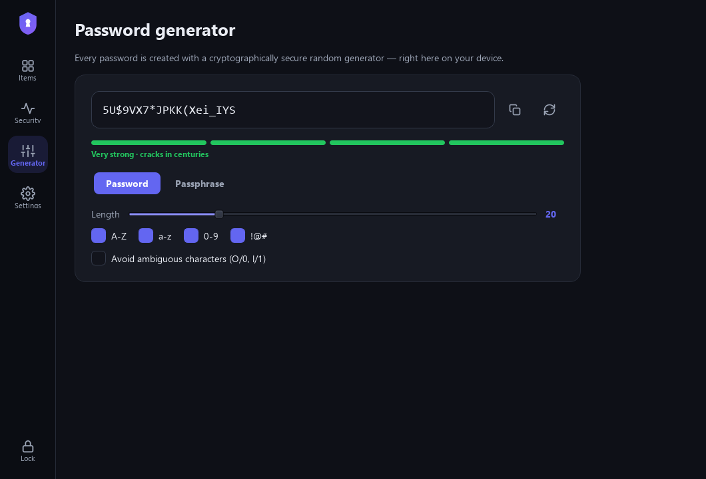

# NoMorePwn

A local desktop password vault with groups, history, a password generator and browser login capture. Built with Python, PySide6, SQLite and a Chromium/Firefox extension. Browser autofill is not implemented.



## Use cases

Organize local credentials into groups, generate passwords, review credential history, or capture a login into an unlocked desktop vault. The screenshots and tests use fictional accounts in disposable vaults.

Password and note fields use authenticated AES-GCM encryption. Service names, usernames and group metadata remain plaintext in SQLite. Password derivation uses Argon2id, with a PBKDF2 fallback. These implementation choices have not received an independent security audit.

## Releases and install (Windows)

Windows builds are published on the [Releases page](https://github.com/grloper/NoMorePwn-Password-Manager/releases). Each release has three assets:

- `NoMorePwn-<version>-Setup.exe`: installer (Start-menu shortcut, optional launch at sign-in, uninstaller; no admin rights required).
- `NoMorePwn-<version>-portable.exe`: single-file portable build.
- `SHA256SUMS.txt`: SHA-256 checksums of the two `.exe` files.

**Status: pre-release.** Builds are produced by a manually triggered workflow (which first runs lint and the test suite) and are marked as GitHub *pre-releases*. Earlier pre-releases were published automatically on every push to `main`. They are not reviewed release candidates, and no independent audit has been done. The in-app updater only follows the release GitHub marks as "Latest", which is a manual promotion step; at the time of writing that is an older build than the newest pre-releases.

**The installers are not code-signed.** Windows SmartScreen will likely warn when you run them. Before running a download, compare its hash with `SHA256SUMS.txt`:

```powershell
Get-FileHash .\NoMorePwn-<version>-Setup.exe -Algorithm SHA256
```

The checksum file is published in the same release as the binaries, so it detects corrupted downloads but does not protect against a compromised GitHub account or release. macOS and Linux have no packaged builds; run from source (below).

See [SECURITY.md](SECURITY.md) for reporting vulnerabilities and [docs/THREAT_MODEL.md](docs/THREAT_MODEL.md) for what the app does and does not defend against.

## Run from source

Use Python 3.10+ in a dedicated virtual environment:

```sh
python -m venv .venv
# Activate the environment for your shell.
python -m pip install -r requirements.txt
python -m nomorepwn_app
```

Set `NOMOREPWN_DATA` to a disposable directory before fixture runs. The app includes optional network features such as updates and breach checks; it is not inherently air-gapped.

Install an extension build from `extension/dist/chrome` or `extension/dist/firefox` using the desktop app's browser-specific guidance. Firefox temporary add-ons require `manifest.json` and disappear after restart. Permanent Firefox distribution needs appropriate signing. Native messaging must also be registered for the installed browser; unpacking an extension alone does not establish the desktop connection.

## Executed evidence

A Windows audit run passed 261 Python tests (the suite has since grown; the current `unittest` suite has 296 tests, 1 skipped on Linux, as run locally), 73 extension observer assertions and five origin-boundary tests. A real isolated Chromium extension handled six local login fixtures: success, direct HTTP failure, cross-origin navigation, a redirect ending in HTTP 401, and multi-hop redirects ending at another origin or back at the login form. Its native API was intercepted for this browser test.

A separate real native-host child communicated through Qt local IPC with the desktop controller and an encrypted disposable vault. Actual GUI unlock, saves, lock/re-unlock, failed-save acknowledgements and locked-capture rejection were exercised. This is component-chain evidence, not proof of a fully installed browser-to-desktop setup.

Capture verification is a heuristic: same-origin navigation and a final successful HTTP response contribute evidence. Locked vaults reject capture and ask the user to unlock and retry; plaintext passwords are not queued for later unlock. Cross-origin captures take the existing unverified confirmation path. See [capture evidence and limitations](docs/testing/capture-evidence.md).

```sh
python -m pip install -r requirements-test.txt
python -m unittest discover -s tests -v
cd extension
npm ci --ignore-scripts
npm test
cd ..
python -m playwright install chromium
python tests/browser_capture_e2e.py
python tests/native_capture_e2e.py
```

Headless GUI tests use `QT_QPA_PLATFORM=offscreen`. The integration scripts use temporary fictional vaults, isolated browser profiles and local HTTP fixtures; they do not register a browser host or use a personal vault.



## Source map

| Area | Source |
|---|---|
| Encryption, database and validation | `nomorepwn/` |
| Desktop views and capture handling | `nomorepwn_app/` |
| Native host and registration helpers | `nomorepwn_app/native_host.py`, `nomorepwn_app/browser_bridge.py` |
| Login observation and origin checks | `extension/src/background/` |
| Reproducible fixtures | `tests/`, `extension/tests/` |

Installed browser registration, Firefox runtime behavior, packaged installer behavior, live breach/update providers and independent threat review remain unverified. Python strings can retain copies in memory; this project does not promise complete secret erasure or certified protection.
